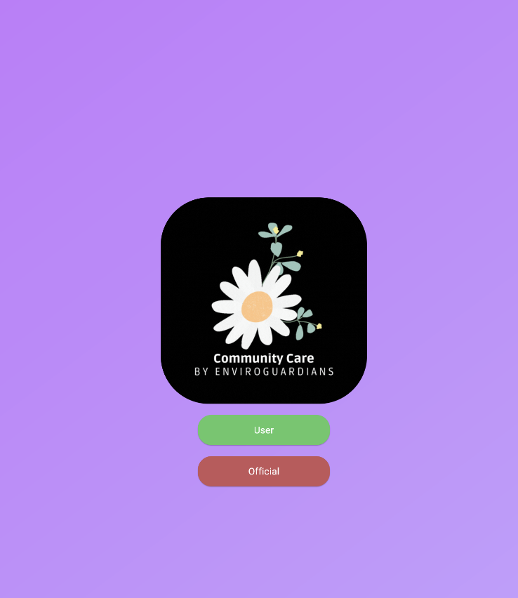
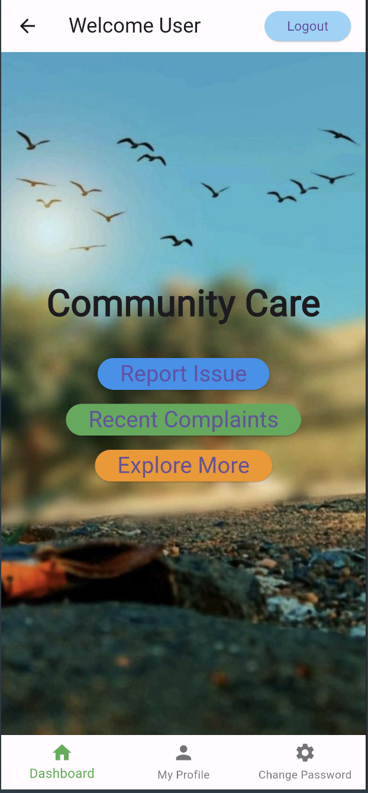
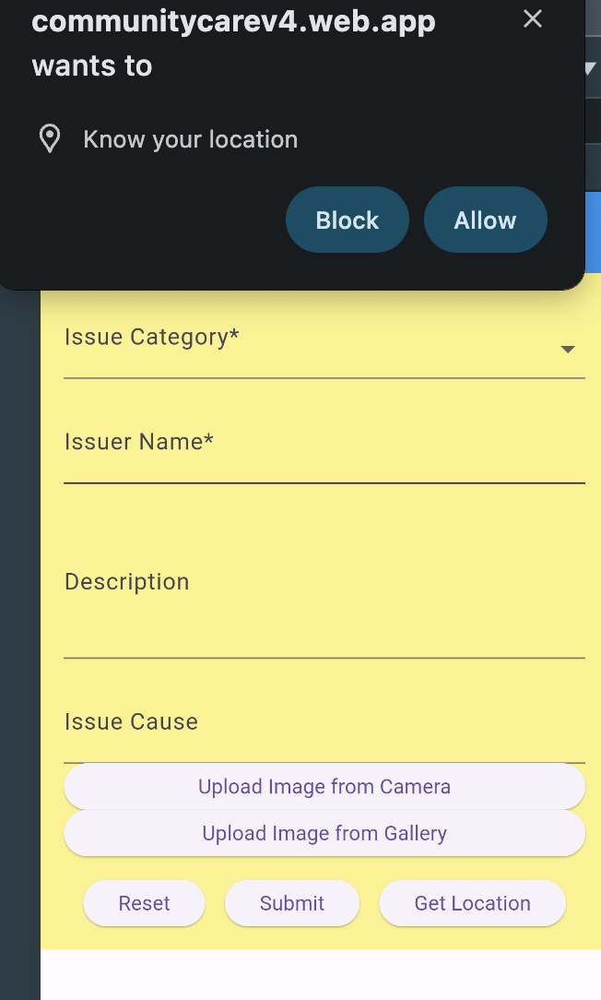
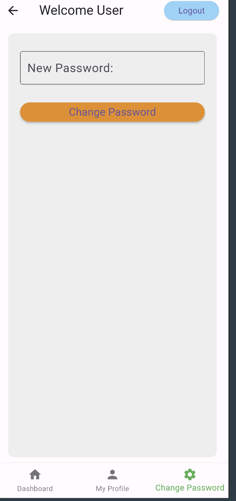

# Community Care

Community Care is an Android application aimed at addressing social problems like sanitation and other issues. Built using Flutter, it leverages various technologies to provide a seamless experience for users seeking to improve their communities.

## Getting Started

Follow these instructions to get a copy of the project up and running on your local machine for development and testing purposes.

### Prerequisites

- Flutter SDK: [Install Flutter](https://flutter.dev/docs/get-started/install)
- Dart SDK: Included with Flutter
- Android Studio: [Install Android Studio](https://developer.android.com/studio)
- Xcode (for iOS development): [Install Xcode](https://developer.apple.com/xcode/)

### Installation

1. **Clone the repository:**
    ```bash
    git clone https://github.com/imRahul05/Community-Care.git
    cd Community-Care
    ```

2. **Install dependencies:**
    ```bash
    flutter pub get
    ```

3. **Run the app:**
    ```bash
    flutter run
    ```

### Screenshots

Here are some screenshots of the app:


<div style="display: flex; flex-direction: row;">
    
    
    
    
</div>

## Project Structure

- **lib/**: Contains the main codebase for the application.
- **assets/**: Contains images, icons, and other assets.
- **screenshots/**: Contains screenshots of the application.

## Built With

- **Flutter**: UI toolkit for building natively compiled applications for mobile, web, and desktop from a single codebase.
- **Dart**: Programming language optimized for building mobile, desktop, and web applications.

## Contributing

1. Fork the repository.
2. Create your feature branch (`git checkout -b feature/AmazingFeature`).
3. Commit your changes (`git commit -m 'Add some AmazingFeature'`).
4. Push to the branch (`git push origin feature/AmazingFeature`).
5. Open a pull request.

## Authors

- **Rahul Kumar**  - [imRahul05](https://github.com/imRahul05)
- **Nitish Kumar**  - [NitishKDev](https://github.com/NitishKDev)
- **Soumyaranjan Panda**  - [soummyaanon](https://github.com/soummyaanon)
- **GnivethaG**  - [GnivethaG](https://github.com/GnivethaG)
- **arpithagowda67**  - [arpithagowda67](https://github.com/arpithagowda67)


## License

This project is licensed under the MIT License - see the [LICENSE](LICENSE) file for details.

## Acknowledgments

- Hat tip to anyone whose code was used.
- Inspiration.
- etc.